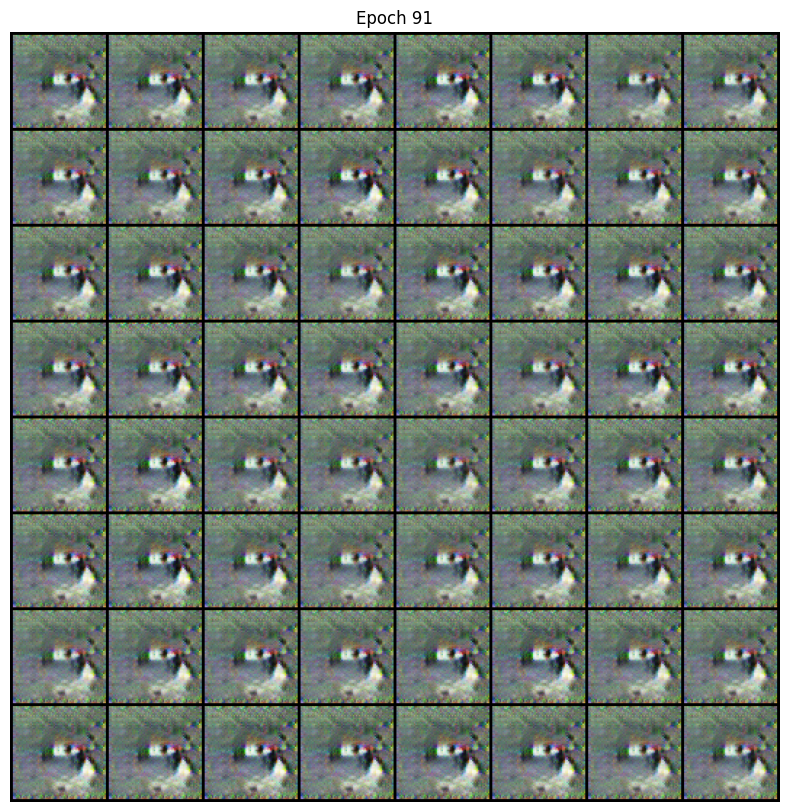

# DCGAN — Image Generation & Mode Collapse Study

A from-scratch implementation of **Deep Convolutional GAN (DCGAN)** in PyTorch, built to study one of the most well-known GAN failure modes: **mode collapse**.

The project trains a generator and discriminator on CIFAR-10 (and later CelebA), and walks through three iterations — V0 → V1 → V2 — showing how small changes (label smoothing, dropout, single-class training) take the model from collapsing at epoch 91 to producing stable, varied samples for 100 epochs.

A full write-up is included as a PDF research report.

---

## What this project is for

GANs are notoriously unstable. The generator and discriminator are locked in a min-max game, and if either side becomes too strong, training falls apart — usually as **mode collapse**, where the generator gives up on diversity and just outputs the same handful of images.

This repo is a hands-on investigation:

1. Build a baseline DCGAN.
2. Reproduce mode collapse.
3. Apply known stabilization techniques one at a time and measure what actually helps.

Everything is written to be readable, not framework-y. The goal is understanding, not a state-of-the-art result.

---

## Results at a glance

| Version | Setup | Outcome |
|---|---|---|
| **V0** | All 10 CIFAR-10 classes, no stabilization | Mode collapse around epoch 91 |
| **V1** | Single class (truck) + label smoothing | Stable for 100 epochs |
| **V2** | V1 + dropout(0.3) in discriminator | ~29% lower D loss variance, best samples |

**V0 — collapse at epoch 91:**



**V2 — stable training, epoch 100:**


For the full analysis (loss curves, per-version comparison, why each fix works), see [`DCGAN Image Generation Research Report.pdf`](./DCGAN%20Image%20Generation%20Research%20Report.pdf).

---

## Project structure

```
.
├── config.py                # All hyperparameters and paths
├── train.py                 # Training loop
├── generate.py              # Sampling / latent-space interpolation
├── models/
│   ├── generator.py         # Transposed-conv generator (64x64 / 128x128)
│   ├── discriminator.py     # Strided-conv discriminator with optional dropout
│   └── weights_init.py      # DCGAN paper init (N(0, 0.02))
├── data/
│   └── dataset.py           # CIFAR-10 + CelebA loaders, optional class filtering
├── utils/
│   ├── checkpointing.py     # Save / resume training state
│   └── visualization.py     # Sample grids + loss plots
└── outputs*/                # Per-version checkpoints and sample images
```

---

## Quick start

Requires Python 3.9+ and PyTorch.

```bash
pip install -r requirements.txt
```

### Train

```bash
python train.py
```

Tweak the dataset, target class, image size, and hyperparameters in `config.py`. The defaults reproduce the V2 setup (single-class truck training with dropout).

### Generate samples from a trained model

```bash
# random samples
python generate.py --checkpoint outputs_class_9_truck_v2_dropout/checkpoints/checkpoint_final.pth

# latent-space interpolation
python generate.py --checkpoint <path> --interpolate
```

---

## Key techniques used

- **Label smoothing** — real labels at 0.9, fake at 0.1, with small noise. Stops the discriminator from getting overconfident.
- **Discriminator dropout (0.3)** — slows D down so G has a chance to keep up.
- **Single-class training** — narrowing the data distribution makes the task tractable at 64×64.
- **D-skip rule** — if D's accuracy goes above 80%, randomly skip its update step. Keeps the game balanced.
- **DCGAN-paper init** — N(0, 0.02) for conv weights, helps avoid early divergence.

---

## Things I learned

- **Balance > tricks.** Most of the work in GAN training is making sure neither network runs away with the game.
- **Start small.** Going from "all 10 classes" to "one class" was the single biggest win.
- **Native resolution matters.** CIFAR-10 is 32×32 — upsampling to 64 helps but you can see the ceiling. CelebA at 128×128 gives much more room.
- **Dropout in D is underrated.** Cheap, simple, and consistently improved sample variety.

---

## What's next

- Train on CelebA at 128×128 (already supported in `config.py`)
- Compare against a small diffusion baseline on the same data
- Try Wasserstein loss + gradient penalty to see if it removes the need for the D-skip hack

---

## References

- Radford et al., [Unsupervised Representation Learning with DCGANs](https://arxiv.org/abs/1511.06434) (2015)
- Salimans et al., [Improved Techniques for Training GANs](https://arxiv.org/abs/1606.03498) (2016)

## License

MIT
